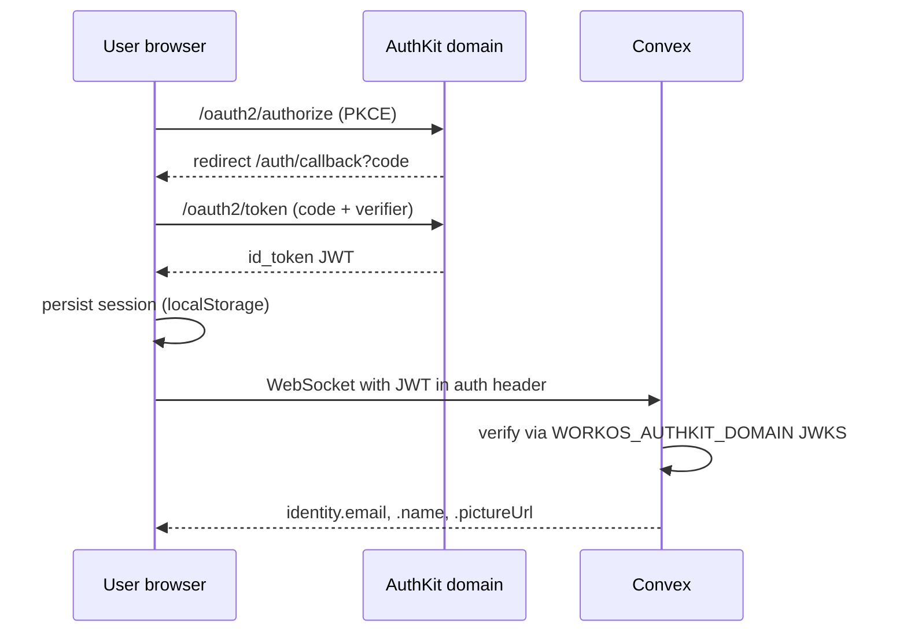

# WorkOS auth migration plan

## Context

- Current: `@robelest/convex-auth@0.0.4-preview.27` + GitHub OAuth + `@convex.dev` allowlist with owner/admin roles. All identity data read via `auth.user.viewer(ctx)` because Robel JWTs only ship `sub`.
- Reference: [get-convex/components-submissions-directory](https://github.com/get-convex/components-submissions-directory) uses a custom PKCE flow in [`src/lib/connectAuth.tsx`](https://raw.githubusercontent.com/get-convex/components-submissions-directory/main/src/lib/connectAuth.tsx) plus `ConvexProviderWithAuthKit` from `@convex-dev/workos`, and `identity.email?.endsWith("@convex.dev")` as the admin gate.
- Target hosting: Convex static hosting only. Production `https://usable-kiwi-349.convex.site/`, dev `https://honorable-mammoth-130.convex.site/`. No Netlify in this repo, so no `/components` base path and no edge functions.

Confirmed: this app is a single-page app served by `@convex-dev/static-hosting` at root `/`, so WorkOS redirect URIs live at `/auth/callback`, not `/components/callback` like the reference.

## Architecture



## Files touched

### Convex backend

- [`convex/auth.config.ts`](convex/auth.config.ts) rewrite: single `customJwt` provider pointed at `https://${WORKOS_AUTHKIT_DOMAIN}` with `jwks` at `/oauth2/jwks`. Drop the `CONVEX_SITE_URL` + `"convex"` audience setup.
- [`convex/auth.ts`](convex/auth.ts) rewrite: remove `createAuth` and provider imports. Export `requireAllowedIdentity(ctx)`, `optionalAllowedIdentity(ctx)`, and an `isAdmin` query. These read `ctx.auth.getUserIdentity()` directly since WorkOS puts email in the JWT once the JWT template is configured. Keep the returned shape compatible with current callers.
- [`convex/convex.config.ts`](convex/convex.config.ts): drop `app.use(auth)` (Robel). Keep `app.use(staticHosting)`.
- [`convex/http.ts`](convex/http.ts): remove the two lines importing `./auth` and calling `auth.http.add(http)` (line 13). WorkOS runs OAuth entirely in the browser; no server routes needed.
- [`convex/lib/auth.ts`](convex/lib/auth.ts) rewrite: `requireAllowedViewer` / `optionalAllowedViewer` now resolve via `ctx.auth.getUserIdentity()` instead of `auth.user.viewer(ctx)`. Signature stays the same so every caller in [`convex/forms.ts`](convex/forms.ts), [`convex/submissions.ts`](convex/submissions.ts), [`convex/guilds.ts`](convex/guilds.ts), [`convex/discord.ts`](convex/discord.ts), [`convex/oauthStates.ts`](convex/oauthStates.ts) keeps working unchanged.
- [`convex/lib/access.ts`](convex/lib/access.ts): unchanged (pure helpers).
- [`convex/users.ts`](convex/users.ts): `access`, `me`, `upsertFromIdentity`, `lookupBySubject` now read email/name/image from `identity` instead of the Robel viewer doc. The `by_subject` index keeps working because WorkOS `identity.subject` is a stable `user_xxx` id.
- [`convex/schema.ts`](convex/schema.ts): no shape change. The existing `users.subject` row keyed to the Robel subject becomes stale; wipe the table in dev (one row) and let the new upsert rebuild it on first login. `guilds.installedByUserId` in dev will need a single re-install or a manual repoint.

### Frontend

- Add [`src/lib/connectAuth.tsx`](src/lib/connectAuth.tsx): copy verbatim from the reference, then change:
  - `returnTo` default in `signOut` to `window.location.origin + "/"` (no `/components` prefix).
  - Default return path in the callback hydrator to `"/app"` instead of `/components/submit`.
- [`src/lib/auth.ts`](src/lib/auth.ts) rewrite: becomes a thin `signOutNow()` helper that delegates to `connectAuth`. Drop the Robel `client({...})`, the `AuthApiRefs` cast, and the localStorage cleanup hack (Connect already handles it).
- [`src/lib/convex.ts`](src/lib/convex.ts): unchanged.
- [`src/main.tsx`](src/main.tsx): wrap the tree in `<ConnectAuthProvider>` then `<ConvexProviderWithAuthKit client={convex} useAuth={useConnectAuth}>` instead of `<ConvexProvider>`. Drop the `"./lib/auth"` side-effect import.
- [`src/hooks/useAuth.ts`](src/hooks/useAuth.ts) rewrite: compose `useConvexAuth()` + `useConnectAuth()`. Expose `{ isLoading, isAuthenticated, signIn, signOut }`. Drop the `phase` state machine; collapse callers of `phase === "loading" | "handshake"` to `isLoading`.
- [`src/components/auth/Protected.tsx`](src/components/auth/Protected.tsx): update the two `phase` checks on line 22 to just `isLoading`.
- [`src/components/auth/SignIn.tsx`](src/components/auth/SignIn.tsx): change the click handler to
  ```ts
  localStorage.setItem("authReturnPath", "/app");
  await signIn();
  ```
  Swap the GitHub icon and "Continue with GitHub" label for a provider-neutral one ("Continue with Convex SSO") since WorkOS AuthKit picks the provider.
- [`src/hooks/useAutoSignOut.ts`](src/hooks/useAutoSignOut.ts): keep. WorkOS can enter the same authenticated-but-denied loop when `isAllowed` is false, so the one-shot `signOut()` still matters.
- [`src/hooks/useEnsureAppUser.ts`](src/hooks/useEnsureAppUser.ts) and [`src/hooks/useMe.ts`](src/hooks/useMe.ts): unchanged.
- [`src/pages/AccessDenied.tsx`](src/pages/AccessDenied.tsx): unchanged. Latched email still displays; the sign-out link already routes back to `/auth/sign-in`.
- [`src/App.tsx`](src/App.tsx): add one route at the top of the outer block: `<Route path="/auth/callback" element={<AuthCallback />} />`. Create [`src/pages/AuthCallback.tsx`](src/pages/AuthCallback.tsx) based on the reference's inline `AuthCallback` component, hard-coded to redirect to `/app` on success.

### Packages

- Add: `@convex-dev/workos`.
- Remove: `@robelest/convex-auth`, `patch-package` (dev dep). Delete the `postinstall` script from `package.json` and delete `patches/@robelest+convex-auth+0.0.4-preview.27.patch`.

### Env vars

Frontend `.env.local` and [`.env.example`](.env.example), drop `AUTH_GITHUB_ID`, `AUTH_GITHUB_SECRET`, `JWT_PRIVATE_KEY`, `JWKS`. Add:

```
VITE_WORKOS_CLIENT_ID=client_01XXXX
VITE_WORKOS_REDIRECT_URI=http://localhost:5173/auth/callback
VITE_WORKOS_AUTHKIT_DOMAIN=<dev authkit domain>
```

Convex dev deployment, via `npx convex env set`:

```
WORKOS_CLIENT_ID=client_01XXXX
WORKOS_AUTHKIT_DOMAIN=<dev authkit domain>
```

Convex prod deployment, same keys but with production WorkOS app values. Unset `AUTH_GITHUB_ID`, `AUTH_GITHUB_SECRET`, `JWT_PRIVATE_KEY`, `JWKS`, and `SITE_URL` once the old code paths are gone.

### WorkOS dashboard (set manually before flipping the envs)

- Redirect URIs on both dev and prod AuthKit apps:
  - `http://localhost:5173/auth/callback`
  - `https://honorable-mammoth-130.convex.site/auth/callback` (dev Convex deploy)
  - `https://usable-kiwi-349.convex.site/auth/callback` (prod Convex deploy)
- CORS origins: same three URLs.
- JWT template claims (Authentication > JWT Templates, per [WorkOS AuthKit docs](https://workos.com/docs/authkit)):
  ```json
  {
    "email": "{{user.email}}",
    "name": "{{user.first_name}} {{user.last_name}}",
    "picture": "{{user.profile_picture_url}}"
  }
  ```
  Without the `email` claim the @convex.dev gate fails closed for everyone.

### Docs

Do a repo-wide sweep to remove every reference to `@robelest/convex-auth`, Robel, and the GitHub OAuth sign-in path. Comments, JSDoc, and prose should describe WorkOS AuthKit instead. Code comments that specifically document Robel quirks (JWT claims gap, `auth.user.viewer`, `normalizeTokens` patch, `AuthApiRefs` cast, refresh-token loop) should be deleted outright, not ported.

Files to rewrite or prune:

- [`README.md`](README.md): rewrite the Stack bullet, Getting started env block, Scripts section (drop Robel CLI key-generation instructions), and Access model paragraph. New language: "Sign in with WorkOS AuthKit. Access is gated to `@convex.dev` emails, with `wayne@convex.dev` as owner and every other `@convex.dev` as admin. Configure in `convex/lib/access.ts`."
- [`docs/setup-guide.md`](docs/setup-guide.md): remove all Robel / GitHub OAuth sections and replace with a WorkOS AuthKit walkthrough (create WorkOS Connect app, set redirect URIs, CORS, JWT template, copy client id + authkit domain into frontend and Convex envs). Link to [workos.com/docs/authkit/hosted-ui](https://workos.com/docs/authkit/hosted-ui).
- [`docs/discord-setup.md`](docs/discord-setup.md): scan for any Robel or GitHub OAuth crossreferences and update them. Discord setup itself is unchanged.
- [`changelog.md`](changelog.md): add a 0.2.0 entry describing the auth migration (removed `@robelest/convex-auth` and GitHub OAuth, added WorkOS AuthKit).
- [`files.md`](files.md): add `src/lib/connectAuth.tsx` and `src/pages/AuthCallback.tsx`; remove `patches/...`; rewrite the `src/hooks/useAuth.ts`, `src/hooks/useAutoSignOut.ts`, `src/lib/auth.ts`, `convex/auth.ts`, `convex/auth.config.ts`, and `convex/lib/auth.ts` descriptions to match the new implementations.
- [`TASK.md`](TASK.md): scrub Robel / GitHub OAuth line items; add a WorkOS migration phase entry.
- [`AGENTS.md`](AGENTS.md) and [`CLAUDE.md`](CLAUDE.md): drop the Robel-specific skill pointers and reference the WorkOS skill from the reference repo instead.
- [`prds/forge-prd_1.md`](prds/forge-prd_1.md) and [`prds/access-control.md`](prds/access-control.md): rewrite the auth provider and env var sections to describe WorkOS.
- [`prds/robel-auth-integration-report.md`](prds/robel-auth-integration-report.md): archive only. Add a one-line header note: "Historical report kept for context. Forge migrated to WorkOS AuthKit on <date>. See `prds/workos-auth-migration.md`." Do not edit the body.
- Add [`prds/workos-auth-migration.md`](prds/workos-auth-migration.md): dev + prod URLs, env matrix, redirect URI list, JWT template, validation checklist, rollback notes.
- [`.cursor/skills/robel-auth/`](.cursor/skills/robel-auth/): delete the folder (skill + `scripts/check-upstream.sh`).
- [`.cursor/rules/dev2.mdc`](.cursor/rules/dev2.mdc): remove Robel / GitHub OAuth mentions; add WorkOS equivalents.
- Code-level comments: rewrite the top-of-file comments in [`convex/auth.ts`](convex/auth.ts), [`convex/auth.config.ts`](convex/auth.config.ts), [`convex/lib/auth.ts`](convex/lib/auth.ts), [`convex/users.ts`](convex/users.ts), [`convex/http.ts`](convex/http.ts), [`src/lib/auth.ts`](src/lib/auth.ts), [`src/hooks/useAuth.ts`](src/hooks/useAuth.ts), [`src/hooks/useAutoSignOut.ts`](src/hooks/useAutoSignOut.ts), [`src/hooks/useEnsureAppUser.ts`](src/hooks/useEnsureAppUser.ts), [`src/components/auth/Protected.tsx`](src/components/auth/Protected.tsx), [`src/components/auth/SignIn.tsx`](src/components/auth/SignIn.tsx), [`src/pages/AccessDenied.tsx`](src/pages/AccessDenied.tsx), and [`src/pages/Dashboard.tsx`](src/pages/Dashboard.tsx). No surviving mention of `Robel`, `@robelest`, `robel-auth`, `GitHub OAuth`, `AUTH_GITHUB_ID`, `AUTH_GITHUB_SECRET`, `JWT_PRIVATE_KEY`, `JWKS`, `auth.user.viewer`, or `AuthApiRefs`.

Final sweep: after the migration lands, run `rg -n "robel|@robelest|GitHub OAuth|AUTH_GITHUB|JWT_PRIVATE_KEY"` from the repo root. The only allowed hit is `prds/robel-auth-integration-report.md` (kept as history).

## Validation

1. Dev: `npx convex env set WORKOS_CLIENT_ID ...`, set domain, set `VITE_*` in `.env.local`, `npm run dev`.
2. Sign in with `wayne@convex.dev` -> lands on `/app`, `users` row has `role: "owner"`.
3. Sign in with another `@convex.dev` address -> `role: "admin"`.
4. Sign in with a non-`@convex.dev` email -> redirected to `/auth/denied`, session signed out, no refresh loop in the Convex dashboard logs.
5. `npm run lint` (tsc) and `npm run lint:code` (eslint) pass.
6. `npm run build` produces a clean static bundle.
7. `npm run deploy` ships to `usable-kiwi-349.convex.site` once prod envs are set in Convex and WorkOS dashboards.

## Risks / notes

- The Robel `users` row keyed to the Robel `sub` becomes stale. Simplest fix in dev is `npx convex run users:deleteAll` via a one-off script or a manual dashboard delete before first WorkOS login. Only affects the dev deploy; prod has never been deployed yet.
- `@convex-dev/workos` version: the reference repo pins `^0.0.1`. Plan uses that range; bump if a newer minor ships before implementation.
- If the JWT template is added late, every sign-in will return `identity.email === undefined` and the allowlist will reject everyone (same failure mode as the Robel viewer bug, recorded in `prds/robel-auth-integration-report.md` section 7). Adding the claim is step 1 of the WorkOS dashboard checklist for a reason.
- `@convex.dev/static-hosting` returns `index.html` for any unmatched path, so `/auth/callback` hits the SPA and the callback component handles the `?code=`. No extra redirect rules needed.
